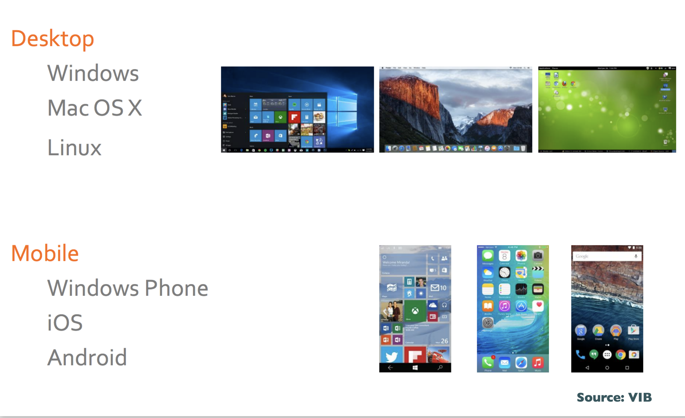
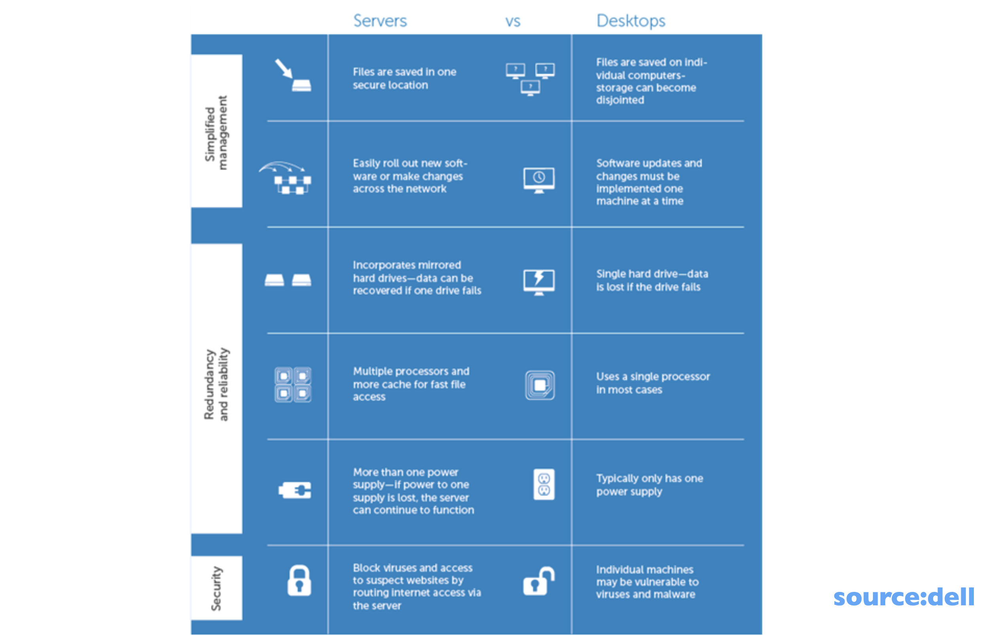
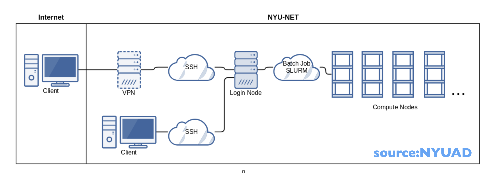
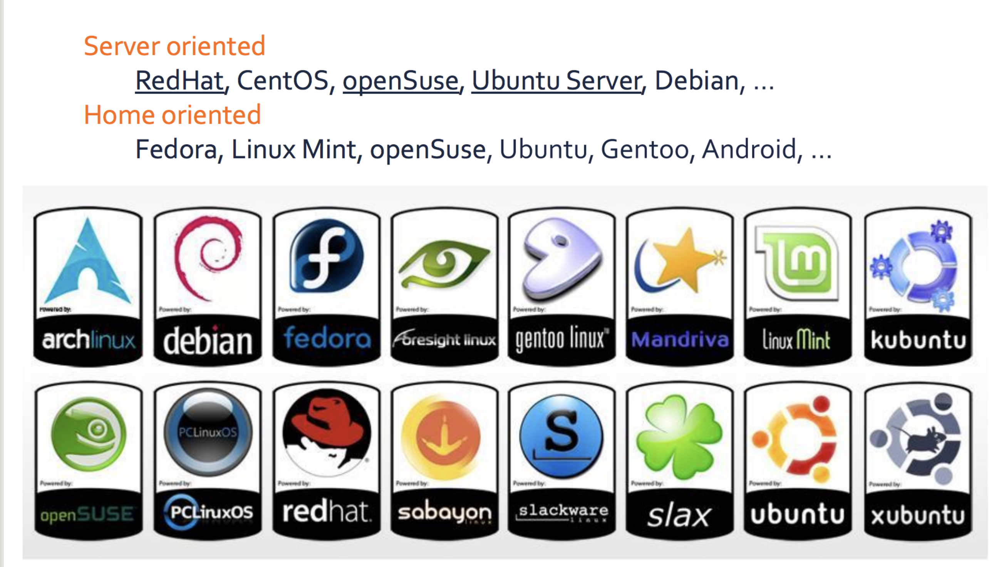
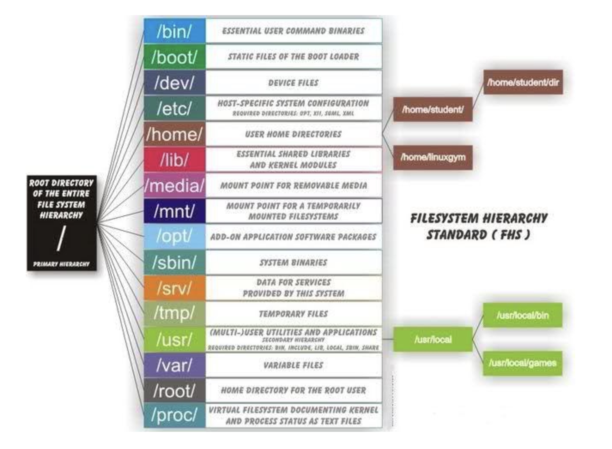
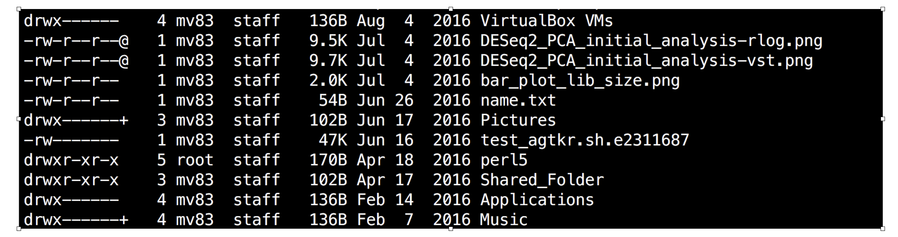

# Module 1 : Basic Linux

Training_Linux

## What is OS

OS (**Operating System**) is a fully integrated set of specialized programs that manages, controls and monitors the execution of all the programs/resources of the computer and acts an interface between the software and the computer hardware.




## Different types of Systems 

 **Servers & Desktop**


**HPC** (High Performance Clusters)

HPC is basically a collection of multiple servers connected together along with a job schedular for workload managment.



## What is Linux OS ?
Linux (**Like Unix**) based on unix OS and is built upon the Linux Kernel. 

## What is kernel ?
The Linux Kernel is the brain of the operating system because it manages how the computer interacts with its hardware and resources to make it works smoothly and efficiently

## Features of Linux

- **Stable**: One of the most stable OS in the world
- **Safe**: Virus-free
- **Adjustable**: Many distributions, you can build your own Linux distribution
- **Free**: Open-source code
- **Multiuser**: Possible to connect to the same server (remote) and execute different programs at the same time
- **Multitasking**: Multiple processes can run on the same server at the same time
- **Networking**: The network is essential for remote access
- **Various user interfaces**: Both text-only and graphical interfaces are available

## Linux Flavours


## File System Structure

In a nutshell Linux file system structure can be defined as directories(Folders) within Directories




**Common top-level directories :** 

|Directories|Description|
|:---:|:---:|
| /bin| binary or executable programs|
|/etc|system configuration files|
|/home|home directory. It is the default current directory|
|/opt|optional or third-party software|
|/tmp|temporary space, typically cleared on reboot|
|/usr| User related programs|
|/var |log files|

**other directories in the Linux system :**
|Directories|Description|
|:---:|:---:|
|/boot|It contains all the boot-related information files and folders such as conf, grub, etc|
|/dev|It is the location of the device files such as dev/sda1, dev/sda2, etc|
|/lib|It contains kernel modules and a shared library|
|/lost+found|It is used to find recovered bits of corrupted files|
|/media|It contains subdirectories where removal media devices are inserted|
|/mnt|It contains temporary mount directories for mounting the file system|
|/proc|It is a virtual and pseudo-file system to contains info about the running processes with a specific process ID or PID|
|/run|It stores volatile runtime data|
|/sbin|binary executable programs for an administrator|
|/srv |It contains server-specific and server-related files|
|/sys|It is a virtual file system for modern Linux distributions to store and allows modification of the devices connected to the system.|


Let look into few directories in the FHS 

 - **/ (Root)**: 

Root folder (**/**) is the primary hierarchy directory also known as directory of the entire file system hierarchy. Every single file and directory start from the root directory. The only root user has the right to write under this directory.

- **/bin** : 

Essential command binaries that need to be available in single-user mode; for all users, e.g., cat, ls, cp. 


- **/etc** :

Host-specific system-wide configuration files. Contains configuration files required by all programs aomg with the startup/shutdown shell scripts used for each of the  programs.

- **/home** :

 Users’ home directories, containing saved files, personal settings, etc.


## Command line interface

Command line interface existed before the Graphical user interfaces (GUI) due to computer power/technology. Still the command line survived in all operating systems and is still useful.


**Terminal Emulator**

A terminal emulator is a program that allows the use of the terminal in a graphical environment. As most people use an OS with a graphical user interface (GUI) for their day-to-day computer needs, the use of a terminal emulator is a necessity for most Linux server users.

Here are some free, commonly-used terminal emulators by operating system:

- **Mac OS X**: Terminal (default), iTerm 2
- **Windows**: ConEmu, Windows Terminal, PuTTy
- **Linux**: Gnome Terminal, Konsole, XTerm


##  Shell

In a Linux system, the shell is a command-line interface that interprets a user’s commands and script files, and tells the server’s operating system what to do with them. There are several shells that are widely used, such as the Bourne-Again shell (bash) and Z shell (zsh). 

A shell is a special user program that provides an interface to the user to use operating system services. Shell accepts human-readable commands from the user and converts them into something which the kernel can understand. It is a command language interpreter that executes commands read from input devices such as keyboards or from files. The shell gets started when the user logs in or starts the terminal. 

By default terminal open your home directory.


- 
**Basic Linux Terminal Commands**

|Linux Commands|Functions|example|
|:---:|:---:|:---:|
|ls |Displays information about files in the current directory| ls |
|pwd |Displays the current working directory| pwd |
|mkdir |Creates a directory| mkdir FOLDERNAME|
|cd |To navigate between different folders| cd /path/to/FOLDERNAME|
|rm -rf |Remove directories  with files and sub directories| rm -rf FOLDERNAME |
|cp |Copy files from one directory to another| cp FOLDERNAME/FILENAME FOLDERNAME2/FILENAME |
|cp |Copy directory from one directory to another| cp FOLDERNAME/ FOLDERNAME3|
|rsync |Copy directory from one directory to another| rsync -avP FOLDERNAME/ FOLDERNAME3|
|mv |Rename and Replace the files|mv FOLDERNAME/ NEWFOLDERNAME|
|rm -rf |Delete folders & files| rm -rf FOLDERNAME/FILENAME|
|ln -s |Create shortcuts/symbolic link to other files| ln -s /path/to/FOLDER/FILENAME FILENAME|
|man |Access manual for all Linux commands| man ls|
|ssh|connecting to a server|ssh -p XXXX USERNAME@DOMAIN|
|chmod|granting/changing permission for folders/files|chmod -R 777 /path/to/FOLDER/|

**Basic Linux Terminal Commands related to files**

|Linux Commands|Functions|example|
|:---:|:---:|:---:|
|touch |Create empty files|touch NEWFILENAME|
|wget |download files over the internet| wget -c 'https://ftp.ensembl.org/pub/release-112/fasta/homo_sapiens/dna/Homo_sapiens.GRCh38.dna.toplevel.fa.gz'|
|gunzip | decompress the gzipped file| gunzip Homo_sapiens.GRCh38.dna.toplevel.fa.gz|
|grep |Search for a specific string in an output| grep -i ">"  Homo_sapiens.GRCh38.dna.toplevel.fa|
|wc -l |Check the lines, word count, and characters in a file using different options| grep -i ">"  Homo_sapiens.GRCh38.dna.toplevel.fa\|wc -l |
|du -sh |size of the file|du -sh Homo_sapiens.GRCh38.dna.toplevel.fa|
|cat/more |Display file contents on terminal| cat Homo_sapiens.GRCh38.dna.toplevel.fa|
|head |Display first few lines of a file| head -n 5 Homo_sapiens.GRCh38.dna.toplevel.fa|
|tail |Display last few lines of a file| tail -n 5 Homo_sapiens.GRCh38.dna.toplevel.fa|

**Basic Linux Terminal Commands related to system information**

|Linux Commands|Functions|
|:---:|:---:|
|uname |Command to get basic information about the OS|
|clear |Clear terminal|
|top -c |Display the processes in terminal|
|echo |Display active processes on the terminal|
|df |Check the details of the file system|


***Note : all system commands are in lower case and is case sensitive***


The ls command is commonly used to identify the files and directories in the working directory. This command is one of the many often-used Linux commands that you should know.

This command can be used by itself without any arguments and it will provide us the output with all the details about the files and the directories in the current working directory. There is a lot of flexibility offered by this command in terms of displaying data in the output. Check the below image for the output.

```
ls -lth
```



- **-l** long list format, including access rights
- **-h** print file and directory sizes in human readable format
- **-t** sort by modification date

For more option try

```
man ls
```

## Users and access rights

**Root**
- create and delete user accounts
- modify access rights
- install and remove programs system wide

**Users**

- Install and remove programs (only for the user)

**Permissions for the data** 
For each folder and files there are 3 types of permission

- **Read**: Display the file
- **Write**: Display and modify the content of the file
- **Execute**: Run a file ( only for scripts and compiled programs)


Every file and directory is protected. A set of permissions determines who can access a certain file and what kind of access is allowed.


There are three level of users: 

- User
- usergroup
- others

There are three level of Permision: 
|permission|score|
|:---:|:---:|
|Read| 4|
|Write|2|
|Execute|1|


<details>
  <summary>Click to expand!</summary>
  
  ### Hidden Section

  Here is the content that will be hidden by default. Click on the "Click to expand!" text above to see this content.

  - Hidden item 1
  - Hidden item 2
  - Hidden item 3

</details>

