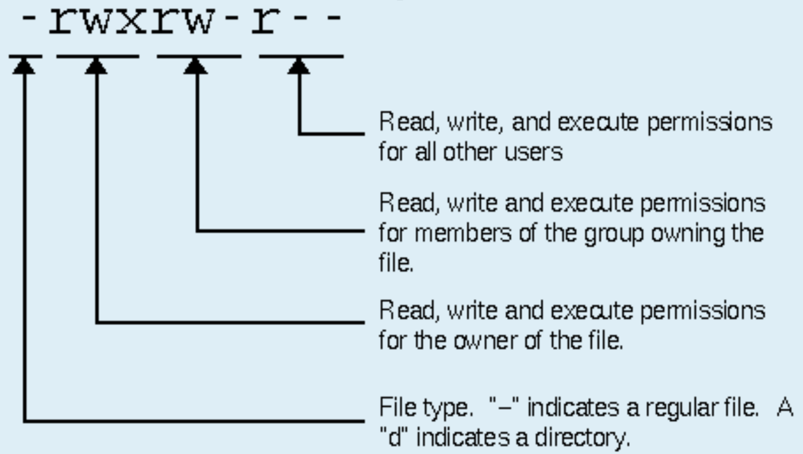

# Module 1 : Basic Linux

This hands on program is tailored to provide participants insight into basic commands in linux. 

## Device(s) that attendees should bring to the workshop (e.g., laptop, smartphone, etc.):
Laptop.

---

## What is OS

OS (**Operating System**) is a fully integrated set of specialized programs that manages, controls and monitors the execution of all the programs/resources of the computer and acts an interface between the software and the computer hardware.


## Different types of Systems 

 **Servers & Desktop**


**HPC** (High Performance Clusters)

HPC is basically a collection of multiple servers connected together along with a job schedular for workload managment.


## What is Linux OS ?
Linux (**Like Unix**) based on unix OS and is built upon the Linux Kernel. 

## What is kernel ?
The Linux Kernel is the brain of the operating system because it manages how the computer interacts with its hardware and resources to make it works smoothly and efficiently

## Features of Linux

- **Stable**: One of the most stable OS in the world
- **Safe**: Virus-free
- **Adjustable**: Many distributions, you can build your own Linux distribution
- **Free**: Open-source code
- **Multiuser**: Possible to connect to the same server (remote) and execute different programs at the same time
- **Multitasking**: Multiple processes can run on the same server at the same time
- **Networking**: The network is essential for remote access
- **Various user interfaces**: Both text-only and graphical interfaces are available

## Linux Flavours


## File System Structure

In a nutshell Linux file system structure can be defined as directories(Folders) within Directories


**Common top-level directories :** 

|Directories|Description|
|:---:|:---:|
| /bin| binary or executable programs|
|/etc|system configuration files|
|/home|home directory. It is the default current directory|
|/opt|optional or third-party software|
|/tmp|temporary space, typically cleared on reboot|
|/usr| User related programs|
|/var |log files|

**other directories in the Linux system :**

|Directories|Description|
|:---:|:---:|
|/boot|It contains all the boot-related information files and folders such as conf, grub, etc|
|/dev|It is the location of the device files such as dev/sda1, dev/sda2, etc|
|/lib|It contains kernel modules and a shared library|
|/lost+found|It is used to find recovered bits of corrupted files|
|/media|It contains subdirectories where removal media devices are inserted|
|/mnt|It contains temporary mount directories for mounting the file system|
|/proc|It is a virtual and pseudo-file system to contains info about the running processes with a specific process ID or PID|
|/run|It stores volatile runtime data|
|/sbin|binary executable programs for an administrator|
|/srv |It contains server-specific and server-related files|
|/sys|It is a virtual file system for modern Linux distributions to store and allows modification of the devices connected to the system.|


Let look into few directories in the FHS 

 - **/ (Root)**: 

Root folder (**/**) is the primary hierarchy directory also known as directory of the entire file system hierarchy. Every single file and directory start from the root directory. The only root user has the right to write under this directory.

- **/bin** : 

Essential command binaries that need to be available in single-user mode; for all users, e.g., cat, ls, cp. 


- **/etc** :

Host-specific system-wide configuration files. Contains configuration files required by all programs aomg with the startup/shutdown shell scripts used for each of the  programs.

- **/home** :

 Users’ home directories, containing saved files, personal settings, etc.


## Command line interface

Command line interface existed before the Graphical user interfaces (GUI) due to computer power/technology. Still the command line survived in all operating systems and is still useful.


**Terminal Emulator**

A terminal emulator is a program that allows the use of the terminal in a graphical environment. As most people use an OS with a graphical user interface (GUI) for their day-to-day computer needs, the use of a terminal emulator is a necessity for most Linux server users.

Here are some free, commonly-used terminal emulators by operating system:

- **Mac OS X**: Terminal (default), iTerm 2
- **Windows**: ConEmu, Windows Terminal, PuTTy
- **Linux**: Gnome Terminal, Konsole, XTerm


##  Shell

In a Linux system, the shell is a command-line interface that interprets a user’s commands and script files, and tells the server’s operating system what to do with them. There are several shells that are widely used, such as the Bourne-Again shell (bash) and Z shell (zsh). 

A shell is a special user program that provides an interface to the user to use operating system services. Shell accepts human-readable commands from the user and converts them into something which the kernel can understand. It is a command language interpreter that executes commands read from input devices such as keyboards or from files. The shell gets started when the user logs in or starts the terminal. 

By default terminal open user home directory location.

**Basic Linux Terminal Commands**

|Linux Commands|Functions|example|
|:---:|:---:|:---:|
|ls |Displays information about files in the current directory| ls |
|pwd |Displays the current working directory| pwd |
|mkdir |Creates a directory| mkdir FOLDERNAME|
|cd |To navigate between different folders| cd /path/to/FOLDERNAME|
|rm -rf |Remove directories  with files and sub directories| rm -rf FOLDERNAME |
|cp |Copy files from one directory to another| cp FOLDERNAME/FILENAME FOLDERNAME2/FILENAME |
|cp |Copy directory from one directory to another| cp FOLDERNAME/ FOLDERNAME3|
|rsync |Copy directory from one directory to another| rsync -avP FOLDERNAME/ FOLDERNAME3|
|mv |Rename and Replace the files|mv FOLDERNAME/ NEWFOLDERNAME|
|rm -rf |Delete folders & files| rm -rf FOLDERNAME/FILENAME|
|ln -s |Create shortcuts/symbolic link to other files| ln -s /path/to/FOLDER/FILENAME FILENAME|
|man |Access manual for all Linux commands| man ls|
|ssh|connecting to a server|ssh -p XXXX USERNAME@DOMAIN|
|chmod|granting/changing permission for folders/files|chmod -R 777 /path/to/FOLDER/|

**Basic Linux Terminal Commands related to files**

|Linux Commands|Functions|example|
|:---:|:---:|:---:|
|touch |Create empty files|touch NEWFILENAME|
|wget |download files over the internet| wget -c 'https://ftp.ensembl.org/pub/release-112/fasta/homo_sapiens/dna/Homo_sapiens.GRCh38.dna.toplevel.fa.gz'|
|gunzip | decompress the gzipped file| gunzip Homo_sapiens.GRCh38.dna.toplevel.fa.gz|
|grep |Search for a specific string in an output| grep -i ">"  Homo_sapiens.GRCh38.dna.toplevel.fa|
|wc -l |Check the lines, word count, and characters in a file using different options| grep -i ">"  Homo_sapiens.GRCh38.dna.toplevel.fa\|wc -l |
|du -sh |size of the file|du -sh Homo_sapiens.GRCh38.dna.toplevel.fa|
|cat/more |Display file contents on terminal| cat Homo_sapiens.GRCh38.dna.toplevel.fa|
|head |Display first few lines of a file| head -n 5 Homo_sapiens.GRCh38.dna.toplevel.fa|
|tail |Display last few lines of a file| tail -n 5 Homo_sapiens.GRCh38.dna.toplevel.fa|

**Basic Linux Terminal Commands related to system information**

|Linux Commands|Functions|
|:---:|:---:|
|uname |Command to get basic information about the OS|
|clear |Clear terminal|
|top -c |Display the processes in terminal|
|echo |Display active processes on the terminal|
|df |Check the details of the file system|


**Note : all system commands are in lower case and is case sensitive**

---

# Let's go in depth some of the most commonly used linux commands 

## 1. listing file in a directory

The ls command is commonly used to identify the files and directories in the working directory. This command is one of the many often-used Linux commands that you should know.

This command can be used by itself without any arguments and it will provide us the output with all the details about the files and the directories in the current working directory. There is a lot of flexibility offered by this command in terms of displaying data in the output. Check the below image for the output.

```
ls -lth
```


- **-l** long list format, including access rights
- **-h** print file and directory sizes in human readable format
- **-t** sort by modification date

For more option try

```
man ls
```

## 2. Users and access rights

**Root**
- create and delete user accounts
- modify access rights
- install and remove programs system wide

**Users**

- Install and remove programs (only for the user)

**Permissions for the data** 
For each folder and files there are 3 types of permission

- **Read**: Display the file
- **Write**: Display and modify the content of the file
- **Execute**: Run a file ( only for scripts and compiled programs)


Every file and directory is protected. A set of permissions determines who can access a certain file and what kind of access is allowed.



There are three level of users: 

- User
- usergroup
- others

There are three level of Permision: 

|permission|score|
|:---:|:---:|
|Read| 4|
|Write|2|
|Execute|1|


## 3. Create Folders

This mkdir command allows you to create fresh directories in the terminal itself. The default syntax is mkdir <directory name> and the new directory will be created.

```
mkdir FOLDER_NAME
```

Things to remember :

i) Avoid having spaces in filenames/Folder names; Instead use “-“ “_”

ii)Avoid starting files/folder names starting with digits (Sometimes)

iii) Files/Folder names are case-sensitive

# TASK - 1 :

Create a folder  called  “My Project” and find what type of permission does it have:? 


<details>
  <summary>Task 1 Answer</summary>
  
```
mkdir My_Project

ls -lth
```

</details>

## 4. Changing permission

**chmod** : is used to change permission 

|permission|score|
|:---:|:---:|
|Read| 4|
|Write|2|
|Execute|1|

Provide full permission to the folder:

```
chmod 777 My_Project
```

# Task - 2 :

Give only read permission to others and read &write permission to the user group and read ,write and execute permission to user(you) for the folder My_Project” 

<details>
  <summary>Task 2 Answer</summary>
  
```
chmod 764  My_Project

ls -lth
```

</details>

## 5. Traversing  through Directories

**cd** : change directory


|Description|Command|
|:---:|:---:|
|Go the to the folder|cd  My_Project|
|Go the to the previous location|cd  ../|
|remove/delete directory|rmdir  My_Project|
|rename  folder|mv  My_Project My_Project1|
|move folder to new location|mv  My_Project1 ../My_Project|


# Task - 3  :

- Create a Folder called Linux and inside Linux create another folder called DATA
- Give full permission for the folder DATA
- rename the folder “Linux” to “myProject”
- Go inside folder DATA and list all the files including hidden files
- remove/delete folder “Linux”


<details>
  <summary>Task 3 Answer</summary>

 - Create a Folder called Linux and inside Linux create another folder called DATA

```
mkdir Linux
cd  Linux
mkdir DATA
```
**or**

```
mkdir-p  Linux/DATA
```

- Give full permission for the folder DATA
  
```
chmod 777 Linux/DATA
```

- rename the folder “Linux” to “myProject”

```
cd  ../
mv Linux myProject
```
**or**

```
mv Linux myProject
```

</details>

## 6. Downloading files over internet

wget command in the Linux command line allows you to download files over the internet. 

```
wget -c “https://ftp.ensembl.org/pub/release-112/gtf/homo_sapiens/Homo_sapiens.GRCh38.112.gtf.gz”

```
In mac :

```
curl -o Homo_sapiens.GRCh38.112.gtf.gz https://ftp.ensembl.org/pub/release-112/gtf/homo_sapiens/Homo_sapiens.GRCh38.112.gtf.gz
```

## 7. Compressing Files/Folders

There are many tools that can compress you data (files/Folder) into a single file for efficient storage and transfer files as they reduce the size of the file drastically. This is an useful method for archieving the data. 

There are many tools that can be used such as

- zip
- tar

**Command used for zip**:

``
zip File/folderName
``

**Command used for tar**

For creating a normal tar file
```
tar -cvf File File_Folder_Name.tar File_FOLDER_Name
```

for creating tar.gz file
```
tar -zcvf File File_Folder_Name.tar.gz File_FOLDER_Name
```

- **-c** : Compress/Archieve
- **-v** :verbos
- **-f** : File name
- **-z** : Compress with gzip

**tar -zcvf  is same as tar -z -c -v -f**


## 8. Uncompressing Files/Folders

There are many tools that can be used such as

- guzip
- untar

**Command used for unzip**:

```
gunzip File_Folder_Name.zip
```


**Command used for tar**

For untaring a normal tar file

```
tar -xvf File File_Folder_Name.tar
```

For untaring a normal tar.gz file

```
tar -zxvf File File_Folder_Name.tar.gz
```

- **-x** : extract
- **-v** :verbos (Display the progress)
- **-f** : File name
- **-z** : unCompress with gzip
  
**More info on other options can be found using command “man zip” | “man tar” | “man unzip”**


# Task - 4  :
 Uncompress the last downloaded file

 
<details>
  <summary>Task 4 Answer</summary>
 
```

 gunzip Homo_sapiens.GRCh38.112.gtf.gz

```

</details>


## 9. Copying Files/Folders


**a) cp**    : copy-paste a file from a given location to another file

copy a single file

```
cp filename /path/to/new/location
```

if you need to copy a folder

```
cp -R folder name /path/to/new/location

```
- **-R** :Copies the directory and the entire contents

***More option on cp  “man cp”***


**b) mv**    : move(cut) a given file/folder from one location to another. This command is also used to rename a folder name

relocating the file/folder

```
mv file/Folder /path/to/new/location

```

renaming the file/folder

```
mv file/Folder NEWname
```

***More option on mv  “man mv”***


**c) rsync** : sync a file or folder from one location to another (like cp command but much faster. Unlike cp command this rsync will copy only new/updated files to new locations.) 

```
rsync file/Folder /path/to/new/location

```

***More option on rsync  “man rsync”***

**d) ln -s** : Create symbolic links. (Time/memory saving commands)

```

ln -s file /path/to/new/location

```

***More option on ln  “man ln”***


# Task - 5  :
Download the data “https://ftp.ensembl.org/pub/release-84/gff3/homo_sapiens/Homo_sapiens.GRCh38.84.gff3.gz" and and move the downloaded file into folder a new folder Linux2/DATA. Rename the file to “Data” and uncompress the file.


<details>
  <summary>Task 5 Answer</summary>
 
1) Download the data “https://ftp.ensembl.org/pub/release-84/gff3/homo_sapiens/Homo_sapiens.GRCh38.84.gff3.gz

```
curl -o Homo_sapiens.GRCh38.84.gff3.gz https://ftp.ensembl.org/pub/release-84/gff3/homo_sapiens/Homo_sapiens.GRCh38.84.gff3.gz
```
or

```
wget https://ftp.ensembl.org/pub/release-84/gff3/homo_sapiens/Homo_sapiens.GRCh38.84.gff3.gz

```
2) new folder Linux/DATA

```

mkdir -p Linux2/DATA

```
3)  move the downloaded file into folder Linux2/DATA

```
mv Homo_sapiens.GRCh38.84.gff3.gz Linux2/DATA

```
4) Rename the file to “Data” and uncompress the file

```
cd Linux2/DATA
mv Homo_sapiens.GRCh38.84.gff3.gz Data.txt.gz
```

5) Uncompress

```
gunzip Data.txt.gz

```

</details>

---

# File operations 

There are different methods to view your file. 

- View content of the file 
- edit you file (text editors such as vi.vim,nano)
- 
To View big data files use the for

## 10:  shows first few lines of the file

```

more filename

```
  
 ## 11 shows last few lines of the file

```
 tail filename

```
   
## 12 shows first # lines(10) of the file
  
 ```
  head -n 10 filename

  ```

## 13 show specific line(s) or number of lines
 
   - print 2nd line :
     ```
      sed -n '2p'  file.txt
    ```
    
   - print line 10 up to line 33 :
     ```
     sed -n '10,33p' file.txt
     ```
     
   - print 1st and 3th line :
     ```
     sed -n '1p;3p' file.txt
     ```
     
# Task - 6  :

Display first 10 lines from Data.txt

Display lines from 30 to 40 and write the same to new file called “selected.txt”


<details>
  <summary>Task 6 Answer</summary>

Display first 10 lines from Data.txt
```
head -n 10  Data.txt
```

Display lines from 30 to 40 and write the same to new file called “selected.txt”

```
sed -n '30,40p' Data.txt 
sed -n '30,40p' Data.txt > selected.txt
```
</details>

## 14 grep

The ‘grep’ command is a powerful way of searching words or patterns in files. There are several options available;

**-c** print the number of resulting lines
**-i** case-insensitive search
**-v** print lines that not match the pattern
**-n** add line number in front of the result
**-r/-R** search all files recursively under each directory

***More option on grep “man grep”***

```
grep “pattern” File
```

prints all the lines with word exonic 

```
grep “miRNA_gene” Data.txt

```
prints number of times the word exonic is found in file

```
grep -c “miRNA_gene” Data.txt
```


# Task - 7  :

- Find all the lines which has “snRNA_gene” in the downloaded file and write into new file called “snRNA_gene.txt”
  
- Find number of times word “pseudogene” is found in the data
  
- Display first 3 lines from snRNA_gene.txt


<details>
 
  <summary>Task 7 Answer</summary>

1) Find all the lines which has “snRNA_gene” in the downloaded file and write into new file called “snRNA_gene.txt”
   
```
             grep “snRNA_gene” Data.txt >snRNA_gene.txt
```

2) Find number of times word “pseudogene” is found in the data

```
            grep -ic “pseudogene” Data.txt
```

3) Display first 3 lines from synonymous.txt


```
           head -n 3 snRNA_gene.txtxt > selected.txt
```
</details>


# Task - 8  :

- Find all the lines which has “snoRNA” and  “lincRNA” in the downloaded file and write into new file called “New.txt”
  
- Download “http://plasmodb.org/common/downloads/release-28/Pfalciparum3D7/fasta/data/PlasmoDB-28_Pfalciparum3D7_Genome.fasta” into folder YIL/PF3D7. Find number of chromosomes?
  
- Find number of Sequences having  motif “AAAATGTTATATATATATATATATAT"


<details>
 
  <summary>Task 8 Answer</summary>

1) Find all the lines which has “snoRNA” and  “lincRNA” in the downloaded file and write into new file called “New.txt”

   
```

grep “snoRNA” Data.txt >snoRNA.txt

grep “lincRNA” Data.txt >lincRNA.txt

cat snoRNA.txt lincRNA.txt >New.tx

```

2) Download “http://plasmodb.org/common/downloads/release-28/Pfalciparum3D7/fasta/data/PlasmoDB-28_Pfalciparum3D7_Genome.fasta” into folder Linux3/PF3D7. Find number of chromosomes?

Step1 : Download

```
curl -o PF3D7.fasta http://plasmodb.org/common/downloads/release-28/Pfalciparum3D7/fasta/data/PlasmoDB-28_Pfalciparum3D7_Genome.fasta
```

Step 2: Create folder

```
mkdir -p Linux3/PF3D7
```

Step 3 : mv

```
mv PF3D7.fasta Linux3/PF3D7
```

Step 4 : Find number of Chromosomes

```
grep -c PF3D7.fasta
```


3) Find number of Sequences having  motif “AAAATGTTATATATATATATATATAT"

```
grep -ic "AAAATGTTATATATATATATATATAT" PlasmoDB-28_Pfalciparum3D7_Genome.fasta 

```

</details>

## 15 Short keys

- double press tab: for autofill
  
- cd / cd ~ : will move you to your home directory
  
- Use “|” pipe to make multiple commands

## 16 Other UseFul Commands

- awk
  
- sort
  
- uniq


---

# More Reading 

This module is heavly inspired from different publicially avaiable slides and websites

- SW Carpentry :
https://swcarpentry.github.io/shell-novice/

- SIB : Bioinformatics Course : 
https://www.bits.vib.be/training/79-bits/training/124-linux-for-bioinformatics
  
- geeksforgeeks.org: https://www.geeksforgeeks.org/
